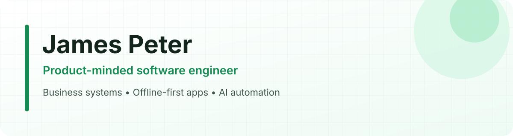

  

I build software for real operational constraints: unreliable connectivity, fragmented workflows, and teams that need systems they can understand and trust.

My work spans **offline-first mobile products**, **TypeScript business platforms**, and **AI-assisted data workflows**, with an emphasis on clear domain models, maintainable architecture, and measurable business outcomes.

## What I build

<table>
<tr>
<td width="33%" valign="top">
<strong>Operational software</strong> 
Business systems that replace scattered spreadsheets and manual handoffs with structured workflows.
</td>
<td width="33%" valign="top">
<strong>Offline-first products</strong> 
Mobile experiences designed for field users and unreliable network conditions.
</td>
<td width="33%" valign="top">
<strong>AI-assisted automation</strong> 
Auditable workflows that turn documents and operational data into useful, reviewable outputs.
</td>
</tr>
</table>

## Selected work

### [VeeLink Farm](https://github.com/Jadefound/veelink-farm-offline-version)

An offline-first livestock management application for tracking farms, animals, health records, inventory, transactions, and financial performance from a mobile device.

- **Product focus:** practical farm record-keeping with or without internet access
- **Engineering:** persisted domain stores, cross-store financial synchronization, local authentication, typed navigation, responsive mobile/web interfaces
- **Stack:** React Native, Expo, TypeScript, Zustand and AsyncStorage
- **Try it:** [Web application](https://veelink-farm-offline-version.james7peter777.workers.dev) · [Android APK](https://expo.dev/artifacts/eas/PI2YuXnyqwqwB2O6KrOFvZ-7PQ-fqKOc6zKeVRkFLsk.apk)

  
  
  

## Engineering approach

- Start with the business workflow and measurable outcome, not the fashionable tool.
- Keep permissions, auditability, failure paths, and maintainability visible in the design.
- Build the smallest valuable product slice, verify it with real users, then deepen the system.
- Use AI for bounded assistance while deterministic rules protect critical decisions.

## Current focus

I am currently focused on secure business platforms and AI automation for operational teams, especially workflows affected by unreliable connectivity, fragmented records, and manual follow-up.

## Connect

If you are building operational software, an offline-first product, or a practical AI automation workflow, you can reach me through [GitHub](https://github.com/Jadefound).
